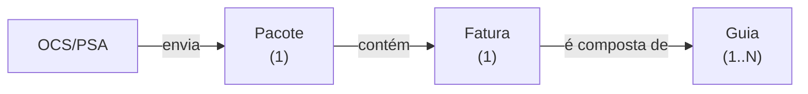

# Glossário

Termos do domínio que aparecem o tempo todo no código. Reconhecê-los evita tratá-los como
nomes genéricos de variável.

> [!tip] Regra de leitura
> O código é escrito em português. `Pacote`, `Glosa`, `Mapa` são **termos de negócio com
> significado preciso**, não traduções casuais. Não "corrija" nomes do domínio.

## Entidades

### A cadeia Pacote → Fatura → Guia

É a estrutura mais importante do domínio, e a mais fácil de errar — inclusive a
[[Sobre a especificação original|especificação original]] a descreve mal.

**Pacote** — a unidade de controle que percorre o fluxo de auditoria. **Contém exatamente
uma fatura.** Model: `app/Models/Pacote.php`, o único com lógica de negócio relevante.

**Fatura** — a cobrança que a OCS/PSA apresenta. É **1:1 com o pacote**, e por isso está
modelada como atributos dele (`numero_fatura`, `valor_fatura`), não como tabela própria. É
única para cada par `(fatura, OCS/PSA)` — regra que sustenta a detecção do
[[Bug do protocolo]].

**Guia** — o documento que **formaliza o atendimento médico realizado**. É a unidade atômica
do negócio: o valor de cada guia soma no valor da fatura. Uma fatura tem **uma ou N guias**.

> [!bug] A guia não existe no sistema
> Não há tabela, coluna, model nem tela — a palavra "guia" não aparece em lugar nenhum do
> código. É um conceito central do domínio que nunca foi implementado.
>
> Consequências: não há como saber quais atendimentos compõem uma fatura, nem localizar em
> que pacote está uma guia. E a invariante `valor_fatura = Σ valor_guia` é inverificável.
>
> É também a razão de o SIRE existir como etapa: a
> [[Sobre a especificação original|especificação original]] diz que "o ciclo de vida da
> **guia** se inicia e termina no SIRE" — o sistema corporativo trabalha no nível da guia,
> enquanto o PMED 2.0 trabalha no nível do pacote. Rastreado em [[P-24]], com a
> implementação planejada em `specs/002-rastreamento-guias/`.

**Mapa** (de pagamento) — agrupamento de pacotes aprovados para uma remessa de pagamento.
Relação **muitos-para-muitos** com pacote, via a tabela `mapa_pacote`. Ver [[Mapas de pagamento]].

**Prestador** — hospital ou clínica credenciada que envia as faturas.

**Conveniado** — o beneficiário do plano de saúde, isto é, o paciente.

**OCS/PSA** — tipos/categorias de unidades prestadoras de serviço. Tabela `ocs_psa`,
configurável na tela de configurações.

## Processo

**Glosa** — contestação ou recusa, parcial ou total, de um valor cobrado. É o coração do
negócio: é por causa dela que existe um pipeline de auditoria em vez de pagamento direto.

**MotivoGlosa** — o motivo formal de uma glosa. Tabela de apoio `motivos_glosa`.

**Recurso** — a contestação que o prestador faz *contra* uma glosa. Tem prazos associados.
Ver [[Glosa, recurso e prazos]].

**Lisura** — a etapa de auditoria/conformidade do fluxo. **Não é sinônimo genérico de
"análise"** — é o nome próprio de uma etapa específica, onde as glosas são abertas.

**SIRE** — a etapa de autorização de pagamento. É nome próprio do domínio; trate como dado,
não como sigla a expandir ou "corrigir".

Mais precisamente: o SIRE é um **sistema corporativo separado**, onde o ciclo de vida da guia
começa e termina, e que **não tem API externa**. A equipe "SIRE" dentro do PMED 2.0 é a ponte
humana entre os dois sistemas. Essa ausência de API é a razão de o PMED 2.0 existir — ele
acompanha a auditoria fora do SIRE, porque não há como integrar.

**Ofício de Glosa** — documento oficial pelo qual a OCS/PSA é notificada da existência da
glosa e do prazo para recorrer. A retirada dele é um marco do processo, com data própria.

**Limite de Crédito** — teto mensal que o plano de saúde pode gastar pagando faturas,
definido no SIRE. Quando não há crédito, o pacote fica com `estado_geral` em
`Aguardando Limite de Crédito` — parado por falta de dinheiro, não por pendência de
auditoria. Ver [[Estados do pacote]].

**Anulação** — invalidação de um pacote já registrado, com trilha de auditoria própria e
restrita ao perfil `admin`. Ver [[Anulação e auditoria]].

## Estados de um pacote

Um pacote carrega três dimensões de estado, que **não são a mesma coisa** — confundi-las é
erro comum ao ler o código:

| Campo | Significa |
|---|---|
| `localizacao_atual` | Onde o pacote está no fluxo: `protocolo`, `lisura`, `sire`, `glosa`, `arquivo`, `arquivado`, `anulado` |
| `localizacao_anterior` | De onde ele veio — **não é histórico, é regra de negócio**: o SIRE decide o destino do pacote olhando para este campo |
| `estado_geral` | `Normal`, `Aguardando Limite de Crédito` ou `Arquivado` |
| `estado_glosa` | Situação da contestação — **9 valores**, com ordem obrigatória |

`localizacao_atual` dirige a navegação por abas da tela de pacotes. `localizacao_anterior` é a
mais fácil de subestimar: ver os 7 casos de ramificação em [[Ciclo de vida do pacote]].

Os quatro campos, seus valores reais e as divergências com o que a migration declara estão em
[[Estados do pacote]].
