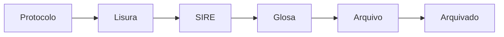

# Visão geral

## O negócio

O cliente é o **FUSEx**, plano de saúde do Exército Brasileiro. Ele paga procedimentos médicos
que **conveniados** (os beneficiários/pacientes) realizam em **prestadores** (hospitais e
clínicas credenciados).

O PMED 2.0 controla esse pagamento. Ele gerencia o ciclo de vida de **pacotes** — lotes de
faturas/guias de procedimentos que os prestadores enviam ao plano para cobrança.

O modelo mental correto é **contas a pagar B2B com um pipeline de auditoria no meio**: nada é
pago sem passar por conferência, e todo valor cobrado pode ser contestado (ver [[Glossário|glosa]]).

> [!info] Por que este sistema existe
> O ciclo de vida da guia começa e termina num sistema corporativo separado, o **SIRE**, que
> **não tem API externa**. Sem integração possível, o acompanhamento da auditoria precisava
> acontecer fora dele — é isso que o PMED 2.0 faz. A equipe chamada "SIRE" dentro do sistema
> é a ponte humana entre os dois.
>
> Isso explica várias escolhas que parecem redundância: valores digitados em vez de
> importados, datas informadas em vez de calculadas, um estado só para "esperando crédito".
> Não há de onde puxar esses dados automaticamente.

## O fluxo

Detalhado em [[Ciclo de vida do pacote]], com o desenho completo em [[Fluxograma original]].
O detalhe que mais confunde quem chega: **cada estágio do fluxo é também um perfil de
usuário** — os papéis não são níveis hierárquicos de permissão, são etapas do processo. Ver
[[Perfis e permissões]] e [[Ações por equipe]].

## Onde ele roda

Dois ambientes, ambos containerizados desde agosto de 2026:

| Ambiente | Endereço | Deploy |
|---|---|---|
| Homologação | `pmed2-homologacao.4rm.eb.mil.br` | Automático ao dar push numa tag `v*.*.*` |
| Produção | `pmed2.4rm.eb.mil.br` | Manual, com aprovação obrigatória |

Detalhes em [[Stack e ambientes]] e [[Runbook de deploy]].

## Como este sistema foi construído

> [!warning] Contexto que muda como você lê o código
> O PMED 2.0 foi o primeiro sistema desenvolvido pelo autor com auxílio de IA — geração de
> código por chat, sem agentes e sem revisão estrutural. Isso deixou marcas concretas e
> previsíveis, catalogadas em [[Dívida técnica]]:
>
> - **Não existe camada de negócio.** 100% da lógica está em controllers.
> - Há **tabelas e models abandonados** convivendo com os que estão em uso — ver
>   [[Modelo de dados]] antes de assumir que um model está vivo.
> - A suíte de testes **reporta verde sem executar nada**.
> - O README descreve um modelo de instalação que não é mais o usado.
>
> Nada disso é motivo para desconfiar do sistema em si: ele está em produção, funciona e
> atende. É motivo para **não confiar em documentação antiga** e verificar no código.

A infraestrutura já foi normalizada (Docker, CI/CD, ADRs registradas). A aplicação está sendo
normalizada agora — o plano está em `planos/plano-normalizacao-pmed2.md`.
