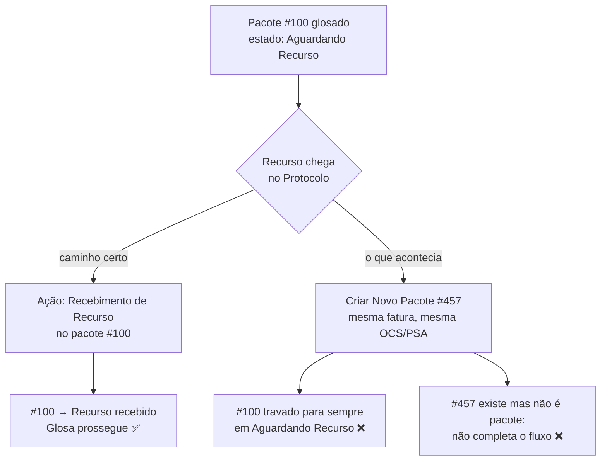

# Bug do protocolo

O problema de integridade de dados mais relevante do sistema. Não é um defeito de código —
é um **fluxo mal executado pelo operador**, que o sistema permitia e não previa.

> [!danger] Afeta produção hoje
> O caminho que gerava o problema foi bloqueado, mas os registros ruins criados antes
> continuam na base, distorcendo relatórios e travando pacotes. A investigação está
> planejada em [`specs/001-caca-bug-protocolo/`](../../specs/001-caca-bug-protocolo/spec.md).

## O que acontecia

Quando uma glosa é aberta, o pacote entra em `Aguardando Recurso de Glosa` e o sistema espera
que a OCS/PSA entregue um recurso — pela única porta que existe, o Protocolo. O caminho certo
é o protocolista abrir o pacote existente e usar a ação **"Recebimento de Recurso de Glosa"**,
que libera o pacote para a Glosa prosseguir.

O que acontecia na prática: o protocolista recebia o recurso no balcão e **dava entrada nele
como se fosse um pacote novo**.



## Por que é grave

O dano é duplo, e ambos os lados são silenciosos:

**1. Inanição do pacote original.** O pacote glosado precisava do registro do recurso para
sair de `Aguardando Recurso de Glosa`. Como o registro foi para outro lugar, ele nunca sai.
Fica parado indefinidamente, sem erro em log nenhum — só não anda.

**2. Poluição da base.** O "pacote" criado a partir do recurso não é um pacote de faturas: é
um documento de contestação. Ele não consegue percorrer o fluxo corretamente até o fim,
porque as regras de negócio pressupõem uma fatura real. E enquanto existe, ele conta nos
relatórios, nos gráficos e nos totais financeiros — inflando a contagem de pacotes e
distorcendo valores.

## Como identificar

A chave é a **unicidade do número da fatura por OCS/PSA**: uma fatura é única para cada par
`(pacote, OCS/PSA)`. Se o mesmo `numero_fatura` aparece duas vezes para a mesma
`ocs_psa_id`, o segundo registro é candidato a ser um recurso cadastrado errado.

```sql
SELECT numero_fatura, ocs_psa_id, COUNT(*) AS ocorrencias,
       GROUP_CONCAT(id ORDER BY id) AS pacote_ids
FROM pacotes
WHERE (anulado IS NULL OR anulado = 0)
GROUP BY numero_fatura, ocs_psa_id
HAVING ocorrencias > 1
ORDER BY ocorrencias DESC;
```

Sinal complementar — os pacotes que ficaram famintos:

```sql
SELECT id, numero_fatura, ocs_psa_id, data_notificacao_glosa, data_limite_retirada
FROM pacotes
WHERE estado_glosa = 'Aguardando Recurso de Glosa'
  AND (anulado IS NULL OR anulado = 0)
ORDER BY data_limite_retirada;
```

Cruzar os dois conjuntos dá os pares (original travado ↔ recurso cadastrado como pacote).

## O bloqueio que existe hoje

`PacotesController::store()` verifica duplicidade de `numero_fatura + ocs_psa_id` entre
pacotes não anulados, e devolve erro com uma orientação específica quando o pacote existente
está aguardando recurso:

```php
if ($estadoGlosa === 'Aguardando Recurso de Glosa') {
    $mensagem .= ' Use o recebimento de recurso de glosa no pacote existente.';
}
```

> [!warning] O bloqueio é só de aplicação, não do banco
> Não existe índice único em `(numero_fatura, ocs_psa_id)`. Qualquer escrita que não passe
> por `store()` — importação, correção manual por `tinker`, um endpoint futuro — recria o
> problema sem encontrar resistência. Ver [[P-22]].

## Por que a base de desenvolvimento não serve para investigar

O ambiente de desenvolvimento não reflete a base de produção. Constatar a extensão real do
problema exige restaurar um **backup de produção** em desenvolvimento e homologação — o que
é, por si só, uma operação que precisa de cuidado com dado real de saúde.

Está planejado como a primeira fase de [`specs/001-caca-bug-protocolo/`](../../specs/001-caca-bug-protocolo/spec.md).

## Lição

O sistema modelava corretamente **o que** deveria acontecer, mas não impedia o operador de
fazer a coisa errada — e a coisa errada era mais parecida com o trabalho cotidiano dele
("chegou papel, dou entrada") do que o caminho certo ("procuro o pacote e registro nele").

Onde uma regra de negócio depende de o operador escolher o caminho certo entre dois que
parecem plausíveis, **a interface precisa fechar o caminho errado** — não apenas documentar
o certo.

Ver [[Ações por equipe]], [[Glosa, recurso e prazos]] e [[P-21]].
