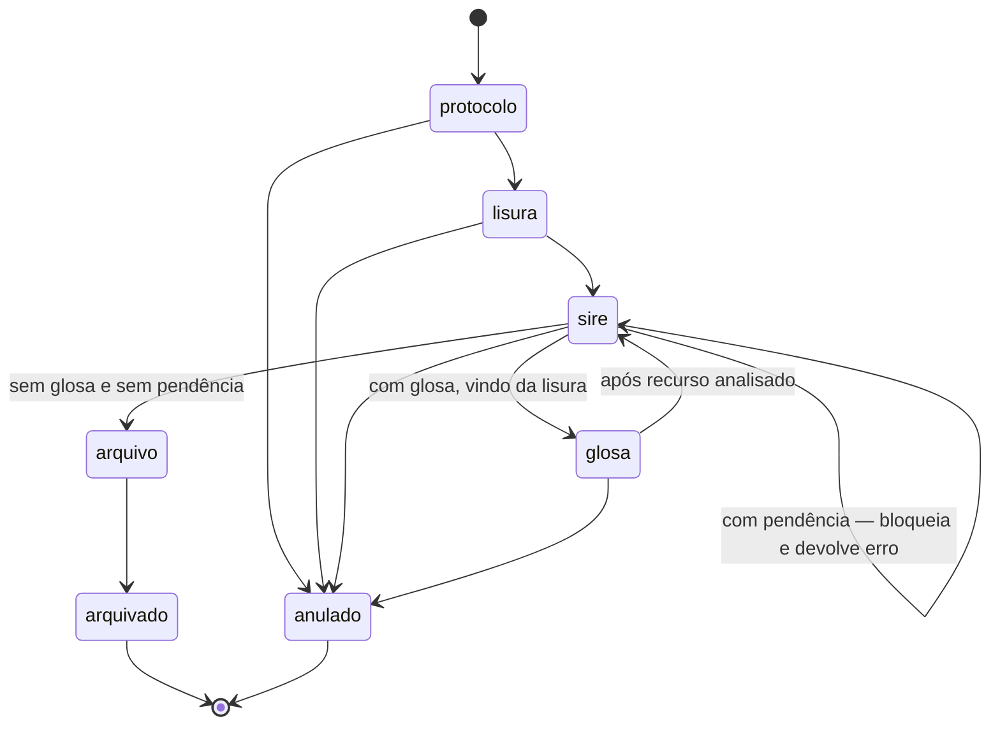

# Ciclo de vida do pacote

A regra de negócio mais importante do sistema. Implementada em
`app/Http/Controllers/PacotesController.php`, principalmente no método `mover()` (linha 603).

> [!warning] O fluxo não é linear
> A representação `Protocolo → Lisura → SIRE → Glosa → Arquivo → Arquivado`, que aparece no
> README e na skill do projeto, é uma **simplificação didática**. O SIRE é um ponto de
> ramificação com **7 casos**, a Glosa devolve o pacote ao SIRE, e há **três pontos onde uma
> equipe age sobre pacote que não está com ela** ([[Ações por equipe]]). Quem tratar isso
> como fila linear vai escrever código errado.
>
> O [[Fluxograma original]] mostra o fluxo inteiro numa peça só, incluindo os retornos —
> vale abrir antes de mexer em qualquer transição.

## O fluxo real



## Quem pode mover

Cada etapa só é movida **pelo perfil homônimo** (ou por `admin`). Em `mover()`:

```php
} else if ($pacote->localizacao_atual == 'lisura' && $user->role === 'lisura') {
```

Ou seja: um usuário `sire` não consegue empurrar um pacote que está em `lisura`. Isso é
intencional — modela a separação de responsabilidades da auditoria. Ver [[Perfis e permissões]].

> [!important] Isso vale para `mover()`, não para todas as ações
> Três ações do sistema quebram deliberadamente essa regra: o Protocolo registra o
> recebimento de recurso em pacote localizado na Glosa, e o SIRE informa pagamento e limite
> de crédito em pacote também localizado na Glosa. São regra de negócio, não descuido — o
> detalhe e a razão de cada uma estão em [[Ações por equipe]].

## A ramificação do SIRE

Quando o pacote está em `sire`, o destino é decidido por três variáveis: se **tem glosa**, se
**tem recurso**, e se **tem valor pendente** — mais o campo `localizacao_anterior`, que diz se
o pacote está passando pelo SIRE pela primeira vez (veio da `lisura`) ou voltando de um
recurso (veio da `glosa`).

| # | Tem glosa | Tem recurso | Veio de | Pendente | Destino |
|---|---|---|---|---|---|
| 1 | não | — | — | não | **Arquivo** |
| 2 | não | — | — | sim | **Erro** — bloqueia |
| 3 | sim | não | lisura | sim | **Glosa** |
| 3.1 | sim | não | lisura | não | **Glosa** |
| 4 | sim | sim | glosa | não | **Arquivo** |
| 5 | sim | sim | glosa | sim | **Erro** — bloqueia |
| 6 | sim | não | glosa | não | **Arquivo** |
| 7 | sim | não | glosa | sim | **Erro** — bloqueia |

A regra por trás da tabela: **valor pendente sempre bloqueia o arquivamento**. Um pacote só
sai do fluxo quando não sobra nada a pagar nem a contestar.

`podeMover()` (linha 743) expõe essa mesma decisão como endpoint de verificação prévia, para
a interface avisar antes de o usuário tentar.

## As transições explícitas

Além do `mover()` genérico, há ações nomeadas — cada uma é uma rota `POST` própria:

| Ação | Método | O que registra |
|---|---|---|
| Registrar pagamento | `registrarPagamento` | Valor pago no pacote |
| Aguardando limite de crédito | `registrarAguardandoLimite` | Muda `estado_geral` |
| Notificar glosa | `notificarGlosa` | Data de notificação, inicia contagem de prazo |
| Retirada de ofício | `registrarRetiradaOficio` | Data de retirada do ofício de glosa |
| Recebimento de recurso | `registrarRecebimentoRecurso` | Recurso apresentado pelo prestador |
| Recurso não recebido | `registrarRecursoNaoRecebido` | Prazo esgotado sem recurso |
| Análise de recurso | `analisarRecurso` | Valores recursado e deferido |
| Arquivar | `arquivar` | Fecha o ciclo |

As de glosa e prazo estão detalhadas em [[Glosa, recurso e prazos]].

## Trilha de movimentação

Toda transição grava uma linha em `movimentacoes_pacote` (model `MovimentacaoPacote`), com
usuário e data.

> [!bug] Existe uma tabela `movimentacoes` abandonada
> É a versão 1 dessa trilha, substituída em abril de 2025. O model `Movimentacao` ainda existe
> e aponta para ela. **A tabela viva é `movimentacoes_pacote`.** Ver [[Modelo de dados]].

## Dívida conhecida neste fluxo

> [!bug] `updateLisura()` é código morto
> 219 linhas (`PacotesController.php:316-535`) sem nenhuma rota apontando para elas. Parece
> lógica ativa de uma etapa do fluxo e não é. Ver [[Dívida técnica]].

> [!bug] As 12 transições são uma máquina de estados dentro de um controller
> Não há camada de negócio: a regra acima vive misturada com validação de request e montagem
> de resposta HTTP. Extraí-la é o item F4.3 do plano de normalização, e depende da rede de
> testes existir antes.
