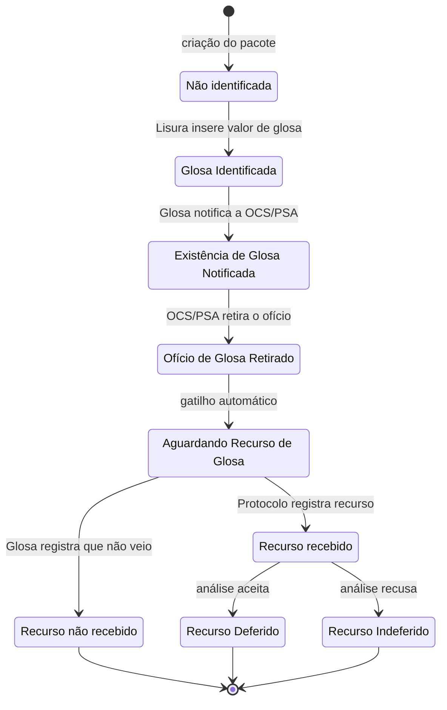

# Estados do pacote

Um pacote carrega **quatro** dimensões independentes. Confundi-las é o erro mais comum ao
ler este código, porque três delas soam como "situação do pacote".

| Campo | Responde à pergunta |
|---|---|
| `localizacao_atual` | **Onde** o pacote está — a equipe que o detém fisicamente |
| `localizacao_anterior` | **De onde veio** — não é histórico, é regra de negócio ativa |
| `estado_geral` | O fluxo está andando, ou parado por causa externa? |
| `estado_glosa` | Onde está o processo de contestação com a OCS/PSA |

> [!important] `localizacao_atual` não determina quem pode agir
> É tentador assumir que a equipe da localização é a única que pode agir sobre o pacote. **É
> falso em dois pontos do fluxo** — ver [[Ações por equipe]]. A autorização real depende da
> combinação `localizacao_atual` + `estado_glosa` + papel do usuário.

## `estado_geral`

Três valores, definidos na especificação original e implementados como tal:

| Valor | Significa |
|---|---|
| `Normal` | Estado inicial. O fluxo está andando |
| `Aguardando Limite de Crédito` | O plano de saúde não tem crédito para pagar agora |
| `Arquivado` | Ciclo de vida encerrado |

`Aguardando Limite de Crédito` existe por uma razão de negócio específica: o FUSEx trabalha
com um teto mensal de gasto, definido no sistema SIRE. Quando não há crédito, o pacote não
está bloqueado por erro nem por pendência de auditoria — está esperando dinheiro. O estado
existe para que a gerência distinga esses dois motivos de parada.

## `estado_glosa` — a máquina de 9 estados

Esta é a regra de negócio mais elaborada do sistema, e a menos óbvia a partir do código.



### Regras que o diagrama não mostra

**A ordem é obrigatória e travada.** Enquanto a ação anterior não for executada, nenhuma
outra ação da equipe Glosa fica disponível. Notificação → Retirada de Ofício → Aguardando
Recurso, nessa ordem, uma vez cada.

**Há um gatilho automático.** Assim que "Retirada de Ofício de Glosa" grava seu log, ela
dispara automaticamente "Aguardando Recurso de Glosa" — o usuário não executa esse passo.

**`Aguardando Recurso de Glosa` é um estado especial.** Ele reconfigura quem pode agir sobre
o pacote — ver [[Ações por equipe]]. É o único estado do sistema que faz isso.

## Divergências entre o declarado e o real

> [!bug] O banco não restringe `estado_glosa`, e os valores do código não batem com o enum
> A migration original declarou um `enum` com **5** valores:
> `Não identificada`, `Glosa identificada`, `Recurso pendente`, `Recurso deferido`,
> `Recurso indeferido`.
>
> A migration `2025_04_16_214627_aumentar_tamanho_colunas_pacotes` converteu a coluna para
> `string(50)`, **removendo a restrição do banco**. O código hoje escreve **9** valores
> diferentes, e nenhum deles é `Recurso pendente`. Além disso a capitalização diverge:
> a migration diz `Glosa identificada`, o código escreve `Glosa Identificada`.
>
> Consequência prática: **qualquer string cabe na coluna**. Um typo em um `estado_glosa =`
> não falha — grava e some. Rastreado em [[P-17]].

> [!bug] `localizacao_atual` tem o mesmo problema, com um agravante de caixa
> A migration declarou `enum(['Protocolo','Lisura','SIRE','Glosa','Arquivo','Arquivados'])`
> — capitalizados, e com `Arquivados` no plural. O código compara em **minúsculas**
> (`localizacao_atual == 'protocolo'`) e usa `arquivado` no singular.
>
> Como a coluna virou `string(50)`, nada reclama. Ao escrever qualquer query nova sobre
> `localizacao_atual`, **confirme o valor real no banco** — não confie nem no enum da
> migration nem nesta nota. Ver [[Modelo de dados]].

## Predicados no model

`app/Models/Pacote.php` expõe alguns testes de estado prontos — prefira usá-los a
recomparar strings:

```php
$pacote->temGlosa();
$pacote->temValorPendente();
$pacote->isAnulado();
$pacote->podeSerAnulado();
$pacote->prazoRetiradaExcedido();
```

Ver [[Ciclo de vida do pacote]], [[Glosa, recurso e prazos]] e [[Anulação e auditoria]].
