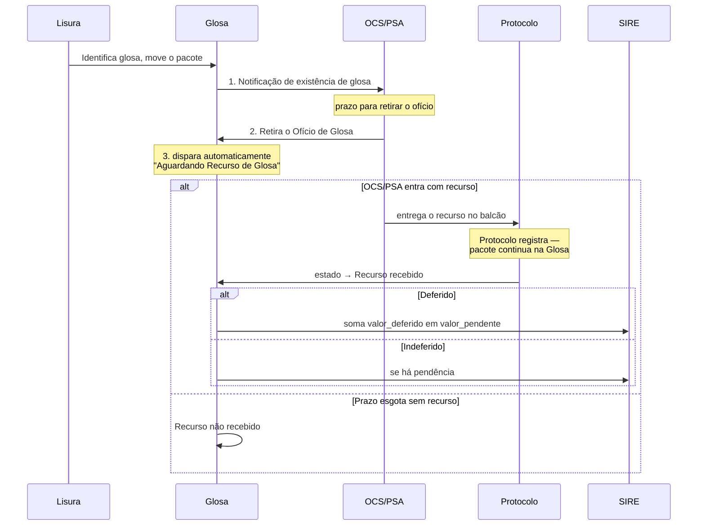

# Glosa, recurso e prazos

**Glosa** é a contestação de um valor cobrado pelo prestador. É a razão de existir o pipeline
de auditoria — sem ela o sistema seria só um registro de pagamentos.

## O ciclo da contestação



A ordem das três primeiras ações é **obrigatória e travada** — enquanto a anterior não
rodar, nenhuma outra ação da equipe Glosa fica disponível. A terceira é automática. Detalhe
em [[Ações por equipe]] e [[Estados do pacote]].

> [!important] Quem recebe o recurso é o Protocolo, não a Glosa
> É o balcão de entrada do sistema. O pacote continua localizado em `glosa`, mas a ação
> pertence ao Protocolo — é a exceção que o [[Fluxograma original]] desenha como a seta de
> volta de "Recurso?" para Protocolo.

## Os valores

Um pacote carrega uma cadeia de valores que precisa ser lida em ordem:

| Campo | Significa |
|---|---|
| `valor_fatura` | O que o prestador cobrou |
| `valor_pos_lisura` | O que sobrou depois da conferência |
| `valor_glosa` | O que foi contestado |
| `valor_recurso_glosa` | O valor sobre o qual o prestador recorreu |
| `valor_recursado` | O valor efetivamente recursado |
| `valor_deferido` | O quanto do recurso foi aceito |
| `valor_pago` | O que foi efetivamente pago |
| `valor_pendente` | O que ainda falta resolver |

> [!important] `valor_pendente` é o campo que trava o fluxo
> Enquanto ele for maior que zero, o SIRE **não arquiva** o pacote — devolve erro. É a regra
> por trás dos casos 2, 5 e 7 da tabela em [[Ciclo de vida do pacote]].
>
> Ele é inicializado com `valor_pos_lisura` (que é `valor_fatura - valor_glosa`), decrementado
> a cada pagamento informado — e **incrementado** quando um recurso é deferido, porque
> deferir significa reconhecer que a glosa foi indevida e o valor volta a ser devido. É a
> única operação do sistema que aumenta a dívida.

Predicados úteis no model `Pacote`: `temGlosa()`, `temValorPendente()`, `percentualPago()`.

## Os prazos

A regra de negócio original prevê **dois prazos de 30 dias**: um para a OCS/PSA retirar o
Ofício de Glosa depois de notificada, outro para entrar com o recurso depois de retirar o
ofício.

| Campo | Marca |
|---|---|
| `data_notificacao_glosa` | Quando o prestador foi notificado da glosa |
| `data_limite_retirada` | Até quando ele pode retirar o ofício |
| `data_retirada_oficio` | Quando efetivamente retirou |
| `data_recebimento_recurso` | Quando apresentou recurso |

> [!warning] O prazo é digitado à mão, não calculado
> `data_limite_retirada` vem do formulário (`$request->data_limite_retirada`,
> `PacotesController.php:1026`) — o sistema **não** soma 30 dias à data de notificação nem
> valida a diferença. O operador digita a data limite.
>
> Isso não é descuido de implementação: a própria especificação original registrou o item
> como não resolvido ("pensar em uma forma de controlar e informar/controlar esse prazo no
> sistema"). Ficou como está desde então.
>
> Consequência: um prazo digitado errado não é detectado, e não há alerta automático de
> vencimento — só a consulta manual da tela de prazos.

Dois predicados no model calculam a situação do prazo:

```php
$pacote->prazoRetiradaExcedido();   // bool — now() passou de data_limite_retirada
$pacote->diasRetiradaRestantes();   // int com sinal — negativo se já venceu
```

`diasRetiradaRestantes()` usa `diffInDays(..., false)`: o `false` preserva o sinal. Um valor
negativo significa prazo **vencido**, não "faltam N dias". Confundir isso inverte a regra.

A tela `pacotes.prazos` (`prazosNotificacoes()`, `PacotesController.php:1284`) consolida essa
visão.

## Motivo da glosa

`motivos_glosa` é a tabela de apoio, editável em Configurações. O pacote referencia via
`motivo_glosa_id`, com `descricao_glosa` como texto livre complementar.

> [!bug] Existe uma tabela `glosas` abandonada
> O modelo original tinha glosas como linhas separadas (uma por item contestado). Em abril de
> 2025 os campos foram **desnormalizados para dentro de `pacotes`**, e a tabela `glosas`
> deixou de ser usada — mas o model `Glosa` continua existindo e apontando para ela.
>
> A chave estrangeira de `motivo_glosa_id` só foi criada em **fevereiro de 2026**, dez meses
> depois da coluna. Ver [[Modelo de dados]].
