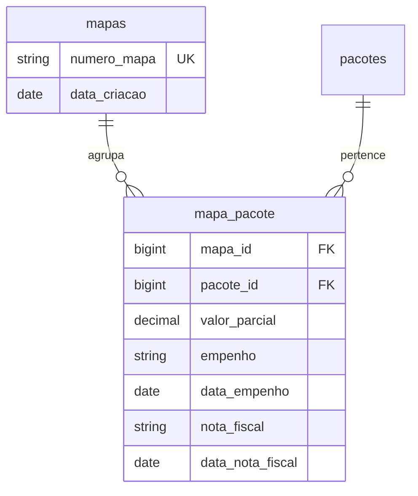

# Mapas de pagamento

Um **mapa** agrupa pacotes aprovados numa remessa de pagamento. É o artefato que fecha o
ciclo: o pacote passou pela auditoria, sobreviveu à glosa, e agora entra numa remessa com
empenho e nota fiscal.

## Por que os mapas existem

Faturas **raramente são pagas de uma vez**. O plano de saúde paga conforme o limite de
crédito libera, em parcelas. O mapa é o registro de cada remessa parcial, com sua própria
forma de pagamento governamental (empenho) e nota fiscal.

Daí o cruzamento em duas direções que a modelagem precisa suportar:

- consultar um **mapa** e ver todas as faturas que ele paga;
- consultar uma **fatura** e ver todos os mapas de que ela participa.

> [!important] Invariante de negócio
> A soma dos `valor_parcial` de todos os mapas em que uma fatura aparece **tem que bater com
> o valor total da fatura**.
>
> Essa invariante não é verificada pelo sistema hoje — não há constraint, validação nem
> relatório de conciliação. É a regra que um relatório de auditoria financeira precisaria
> checar primeiro.

É o mesmo laço de pagamento parcial que o [[Fluxograma original]] desenha entre "Pagamento" e
"Valor Pendente?".

## Modelo

Relação **muitos-para-muitos** via `mapa_pacote`, com `unique(mapa_id, pacote_id)` e
`onDelete('cascade')` nas duas pontas.

O dado financeiro (`valor_parcial`, `empenho`, `nota_fiscal`) mora **no pivô**, não no mapa —
porque cada pacote dentro de um mapa pode ter seu próprio empenho e sua própria nota fiscal.

`Mapa::getValorTotalAttribute()` soma os `valor_parcial` do pivô.

## Quem pode

| Gate | Perfis | O quê |
|---|---|---|
| `mapas-view` | `admin`, `pagamento`, `auditor` | Visualizar |
| `mapas-manage` | `admin`, `pagamento` | Criar e alterar |

São **os dois únicos gates do sistema que protegem rotas de forma consistente** — o resto da
autorização é *ad hoc*. Ver [[Perfis e permissões]].

## Cuidado ao ler as migrations

> [!warning] O mapa nasceu 1:1 e virou N:N um dia depois
> - `2025_05_28_190641_create_mapas_table` criou `mapas` com **`pacote_id` direto**, mais
>   `valor_parcial`, `empenho` e `nota_fiscal` na própria tabela — um mapa por pacote.
> - `2025_05_29_000001_create_mapa_pacote_table`, **no dia seguinte**, criou o pivô e
>   *removeu* essas colunas de `mapas`.
>
> Efeito prático: ler só a primeira migration dá o modelo errado. O schema real de `mapas`
> hoje é apenas `id`, `numero_mapa`, `data_criacao`, `timestamps`.
>
> Uma terceira migration (`2025_06_13_191217_make_mapa_fields_nullable`) tornou `empenho` e
> `nota_fiscal` opcionais no pivô — um mapa pode ser montado antes de o empenho sair.

Este é o padrão geral do repositório: **o schema não se lê pelas migrations, lê-se pelo banco**.
Ver [[Modelo de dados]].

## Código

`app/Http/Controllers/MapaController.php` — 342 linhas, 19 métodos, incluindo busca de faturas
e exportação.
