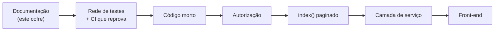

# Dívida técnica

Inventário honesto, levantado em 2026-08-12. Ordenado por **risco**, não por esforço.

> [!info] Por que este documento existe
> O sistema foi construído por geração de código via chat, sem revisão estrutural. As marcas
> disso são previsíveis e catalogáveis. Documentá-las é mais barato do que redescobri-las uma
> por uma, e é o que permite decidir o que corrigir *antes* de mexer no código.
>
> Nada aqui significa que o sistema esteja quebrado: ele está em produção e atende.

## 1. A rede de testes não existe — ela mente

| Fato | Evidência |
|---|---|
| 4 arquivos de teste, 2 testes reais | `tests/` |
| Os 2 reais têm 4 `markTestSkipped` no `setUp()` | `tests/Feature/GraficosDesempenhoTest.php:19-36` |
| `TestCase` não usa `RefreshDatabase` | `tests/TestCase.php` |
| Sem bloco `<coverage>` | `phpunit.xml` |
| Factories para 2 dos 13 models | `database/factories/` |

Como o `TestCase` nunca roda migrations, no CI as tabelas não existem, os testes **pulam em
silêncio** e a suíte reporta verde. Cobertura efetiva de rotas: ~2%.

O CI de qualidade completa o quadro (`.github/workflows/ci.yml`):

- o passo do PHPStan **se auto-ignora** se o binário não existir — e ele nunca foi instalado;
- `composer audit` emite `::warning::` em vez de falhar;
- Pint está no `require-dev` desde sempre e **nunca é invocado**, e não há `pint.json`.

**Este é o item mais grave da lista**, porque é o que impede corrigir todos os outros com
segurança.

## 2. Segurança

Ver [[Perfis e permissões]] e [[Ações por equipe]] para o detalhe.

- `anulacao.ver` desprotegida (`routes/web.php:222`).
- `registrarPagamento` não verifica a localização do pacote, embora a especificação exija
  ([[P-18]]).
- 35 rotas `auth`-only cobrindo mutação financeira, relatórios e notas de desempenho.
- `CheckRole` existe, nunca foi registrado — aparenta proteção que não existe.
- `Log::info` com e-mail e papel a cada checagem do gate `admin`.
- **`.env` ainda está no histórico do Git**, em repositório público ([[Pendências|P-8]],
  marcada CRÍTICA e nunca executada).
- **A senha de reset é fixa e está no código** (`UserController.php:131`), num repositório
  público, sem troca obrigatória no próximo login ([[P-20]]).
- README publicava a credencial padrão `admin@admin` — removido em 2026-08-12.
- 30 scripts de CDN sem SRI — risco de cadeia de suprimentos num sistema interno.

## 3. Ausência de camada de negócio

**Zero linhas** em `app/Services/`, `app/Actions/`, `app/Repositories/`, `app/Jobs/`,
`app/Http/Requests/`, `app/Policies/`. Nenhum desses diretórios existe.

5.911 linhas de controller, com 88% em seis arquivos:

| Controller | Linhas | Concentra |
|---|---|---|
| `PacotesController` | 1.512 | 12 transições de estado, CRUD, auditoria, PDF |
| `GraficoController` | 1.351 | 13 endpoints, 38 `DB::` crus, algoritmo de desempenho |
| `PesquisaController` | 888 | 510 linhas só de exportadores (57% do arquivo) |
| `ConfiguracoesController` | 603 | Configurações + 3 CRUDs + fluxo de anulação |
| `RelatorioController` | 491 | 5 relatórios, **0 `validate()`, 0 `try/catch`** |
| `MapaController` | 342 | Mapas + busca + exportação |

Consequências: 37 `validate()` inline em vez de Form Requests; autorização espalhada; regra de
negócio não testável isoladamente.

## 4. Desempenho — o defeito que já derrubou produção

`PacotesController::index()` (linha 22) materializa a tabela `pacotes` **inteira**, sem
paginação e sem `where`, e `resources/views/pacotes/index.blade.php` (1.041 linhas) re-varre
essa mesma coleção **~13 vezes em memória** para montar abas e contadores.

Isso causou erro 500 em produção na v2.1.4. A mitigação aplicada foi elevar o `memory_limit`
para 512M ([[ADR-09]]) — **mitigação, não correção**. A correção é uma query paginada por aba
mais uma query agregada para os contadores.

## 5. Código morto

| Item | Tamanho |
|---|---|
| `PacoteController.php` (singular) | 104 linhas, **zero rotas** |
| `PacotesController::updateLisura()` | 219 linhas, **zero rotas** |
| `HomeController.php` | 28 linhas, não roteado |
| Models `Movimentacao` e `Glosa` | tabelas abandonadas |
| 3 métodos `*OcsPsa` em `ConfiguracoesController` | duplicam `OcsPsaController` |
| `routes/web.txt` | 231 linhas, cópia obsoleta |
| `resources/js/components/DashboardKpi.vue` | Vue nem está no `package.json` |
| `requirements.txt` | arquivo Python em projeto PHP |

## 6. Front-end

16.872 linhas de Blade — 2,3× todo o `app/`. Dentro delas, **2.233 linhas de JavaScript em
arquivos `.blade.php`** (`graficos/partials/js/`), que não passam por lint, bundle nem cache.

Vite está configurado e é usado em **2** arquivos. O resto carrega ~30 scripts de CDN, com:

- **três versões de Chart.js** convivendo (3.7.1, 2.9.4 e uma sem pin);
- duas de select2, duas de DataTables, quatro de moment;
- **Bootstrap 4.6 via CDN enquanto o `package.json` declara Bootstrap 5**.

Maior esforço da lista, menor urgência — mas é também risco de deploy offline e de cadeia de
suprimentos.

## 7. Processo

- **1 pull request em 128 commits.** Todo o resto foi direto na `main`, incluindo a migração de
  produção.
- Sem PR template, sem CODEOWNERS, sem Dependabot.
- Sem CHANGELOG.
- 81% dos commits seguem Conventional Commits; os que fogem são quase todos de release
  (`Versão 3.0.6`).
- README materialmente errado — manda rodar `install.sh` num sistema Docker, linka dois
  arquivos inexistentes (`relatorio.md`, `LICENSE`).

## Ordem de ataque

A ordem não é negociável nos dois primeiros passos: **sem rede de testes, refatorar é
reescrever no escuro** — e este é um sistema financeiro em produção. O plano completo está em
`planos/plano-normalizacao-pmed2.md`.
