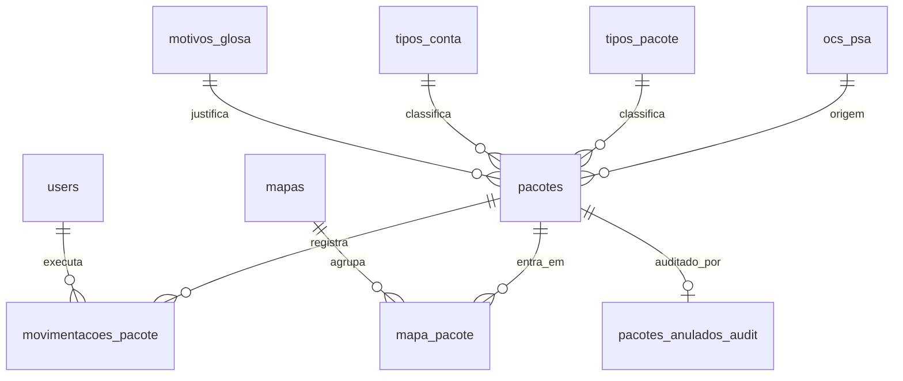

# Modelo de dados

22 tabelas, ~20 MB em produção. `pacotes` tem ~9.700 linhas e `movimentacoes_pacote` ~53.000.
É um banco **pequeno** — o que importa para dimensionar risco: um `mysqldump` leva segundos.

## O núcleo

Tabelas de apoio: `configuracoes` (chave/valor), `pesquisas_salvas`, mais as padrão do Laravel
(`users`, `sessions`, `cache`, `jobs`, `failed_jobs`, `job_batches`, `password_reset_tokens`).

## A entidade que falta: guia

> [!bug] O domínio tem três níveis; o modelo tem dois
> A cadeia real é **Pacote (1) → Fatura (1) → Guia (1..N)** — ver [[Glossário]].
>
> O modelo implementa os dois primeiros: a fatura é 1:1 com o pacote, e por isso está
> corretamente modelada como atributos dele (`numero_fatura`, `valor_fatura`) em vez de
> tabela própria. **A guia não existe** — nem tabela, nem coluna, nem model. A palavra não
> aparece em nenhum arquivo do repositório.
>
> A guia é o documento que formaliza cada atendimento médico, e seu valor soma na fatura.
> Sem ela: não se sabe o que compõe uma fatura, não se localiza um atendimento, e a
> invariante `valor_fatura = Σ valor_guia` não pode ser verificada.
>
> Ver [[P-24]] e `specs/002-rastreamento-guias/`.

## Tabelas abandonadas — leia antes de usar um model

> [!danger] Há dois pares de tabelas concorrentes, e os models mortos ainda existem
>
> | Morta | Viva | Desde |
> |---|---|---|
> | `movimentacoes` (model `Movimentacao`) | `movimentacoes_pacote` (model `MovimentacaoPacote`) | abr/2025 |
> | `glosas` (model `Glosa`) | campos de glosa desnormalizados em `pacotes` | abr/2025 |
>
> Os models `Movimentacao` e `Glosa` continuam no repositório, apontando para tabelas que
> ninguém alimenta. Um `Glosa::all()` retorna vazio e **não dá erro** — o pior tipo de
> armadilha. Remoção planejada em F4.0.

Também: **`pesquisas_salvas` tem migration mas não tem model.** `PesquisaController` acessa a
tabela por `DB::table()` cru.

## Por que o schema não se lê pelas migrations

> [!warning] As migrations não reproduzem o schema com confiança
> Vários problemas convivem:
>
> - **Três migrations com o mesmo propósito e quase o mesmo nome** —
>   `add_anulacao_fields_to_pacotes` aparece em `2025_06_14_000001` (136 linhas),
>   `2025_06_14_161136` (28 linhas, **corpo vazio**) e `2025_06_17_000003` (59 linhas). É a
>   origem dos três campos concorrentes de anulação descritos em [[Anulação e auditoria]].
> - **Guardas `hasColumn` e SQL cru** em vez de schema declarativo — o resultado de um
>   `migrate` do zero depende do estado anterior.
> - **Datas retroativas**: as 9 migrations iniciais estão datadas `2023_01_01`, mas o
>   repositório começa em dezembro de 2025. A ordem cronológica é fictícia.
> - **Chave estrangeira criada 10 meses depois da coluna** — `motivo_glosa_id` entrou em
>   abril de 2025; a FK só em `2026_02_08_000001`.
> - **Enums convertidos para `string` sem reconciliar os valores** —
>   `2025_04_16_214627_aumentar_tamanho_colunas_pacotes` transformou `estado_geral`,
>   `estado_glosa`, `localizacao_atual` e `localizacao_anterior` em `string(50)`, removendo a
>   restrição. Os valores que o código grava não batem com os que o enum declarava, nem na
>   capitalização. Ver [[P-17]] e [[Estados do pacote]].
>
> Na prática: **para saber o schema, consulte o banco**, não as migrations. E para saber os
> valores válidos de uma coluna de estado, consulte [[Estados do pacote]] — não a migration.
>
> O lado bom, verificado na migração para produção: `migrate:status` lista 32 migrations, todas
> `Ran`, e batem exatamente com o repositório. O schema está *estável* — só não é reproduzível
> a partir do zero com garantia.

## Concentração da lógica

`app/Models/Pacote.php` (283 linhas) é o **único** model com lógica de negócio relevante:
34 campos em `$fillable`, os predicados de [[Ciclo de vida do pacote]] e
[[Glosa, recurso e prazos]], os escopos `validos()`/`anulados()` e o mutador `anular()`.

Os outros 12 models somam ~530 linhas e são quase todos declaração de relação. `TipoPacote`,
`TipoConta` e `MotivoGlosa` têm 14 linhas cada e **não declaram a relação inversa**.

## Filas

`jobs`, `failed_jobs` e `job_batches` estão migradas e **vazias** — nada é enfileirado no
sistema. Ao mesmo tempo, exportações de PDF e Excel sobre resultados sem limite rodam
sincronamente no escopo da requisição. A infraestrutura existe e não é usada; ver
[[Dívida técnica]] (F4.4).
