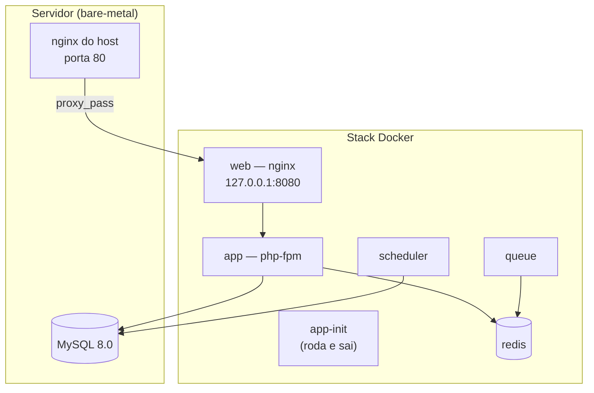

# Stack e ambientes

## Stack

| Camada | Tecnologia |
|---|---|
| Framework | Laravel 12, PHP 8.2+ |
| Banco | MySQL 8.0 — **no host, fora do Docker** ([[ADR-01]]) |
| Cache e fila | Redis ([[ADR-03]]) |
| Views | Blade + AdminLTE 3 |
| Assets | Vite configurado — mas ver [[Dívida técnica]], quase tudo vem de CDN |

A versão da aplicação é o campo `version` do `composer.json`. É **a fonte da verdade**,
validada pelo CI contra semver e usada pela UI. Não escreva a versão em prosa em lugar nenhum.

## A stack Docker

Seis serviços, nenhum deles banco de dados:

Pontos que costumam surpreender:

- **O nginx do host não foi removido.** Ele virou proxy reverso para a stack ([[ADR-02]]). Isso
  é o que torna o rollback barato: basta trocar o server block de volta.
- **O MySQL continua no host.** A stack alcança o banco pelo **IP fixo do gateway** da rede
  Docker, não por `host.docker.internal` ([[ADR-08]]).
- **`app-init` não fica de pé.** Ele roda migrations e cache, sai com código 0, e some do
  `docker compose ps`. Container ausente ali não é falha.
- Os containers rodam como `www-data` (uid 82), não root ([[ADR-05]]).

## Ambientes

| | Homologação | Produção |
|---|---|---|
| Host | `pmed2-homologacao.4rm.eb.mil.br` | `pmed2.4rm.eb.mil.br` (`10.122.8.15`) |
| Rede Docker | própria | `pmed2-prod-net`, `10.219.20.0/24` |
| Deploy | **Automático** ao dar push numa tag `v*.*.*` | **Manual**, com aprovação obrigatória |
| TLS | não | não ([[Pendências|P-3]]) |

Migrados para Docker em 10 e 11 de agosto de 2026, respectivamente.

> [!warning] Não há SSH direto para os servidores
> O acesso é por **Teleport, no navegador**. Na prática: quem tem sessão de agente executa
> tudo no repositório e via `gh`; comandos no servidor são executados pelo operador humano,
> preferencialmente por upload de script (colar heredoc grande no Teleport já truncou em
> silêncio). Ver [[Runbook de deploy]].

## Segredos

Nunca por variável de ambiente — **por arquivo** ([[ADR-07]]). O workflow grava o segredo em
`shared/secrets/db_password` com `chmod 600` e concede leitura ao uid 82 via
`setfacl -m u:82:r`.

> [!info] Por que ACL e não `chown`
> `chown` para outro uid exige root, e o usuário de deploy não tem sudo sem senha. Já o
> **dono** de um arquivo pode conceder leitura a outro uid via ACL sem privilégio nenhum.
> Foi assim que a dívida do [[ADR-05]] foi paga.

O `APP_KEY` vem do `shared/.env` do próprio servidor e **nunca deve ser regenerado**
([[ADR-06]]) — regenerar invalida todas as sessões e torna ilegível todo dado encriptado.

## Pipeline

| Workflow | Dispara | Faz |
|---|---|---|
| `ci.yml` | push/PR para `main` | Qualidade — mas ver [[Dívida técnica]], hoje não reprova nada |
| `docker-build.yml` | push em `main` ou tag `v*.*.*` | Publica a imagem no GHCR |
| `cd-homolog.yml` | tag `v*.*.*` | Deploy automático em homologação |
| `cd-prod.yml` | `workflow_dispatch` | Deploy em produção, com aprovação |

Os dois CD rodam em runner self-hosted, label `pmed2-interno`. Ver [[Runbook de deploy]].

> [!danger] Regra de segurança dos workflows
> **Nunca interpole `${{ secrets.X }}` dentro do corpo de um `run:`.** Passe sempre pelo bloco
> `env:` do step. Isso já foi violado nos dois workflows de CD e teve de ser corrigido
> retroativamente.
