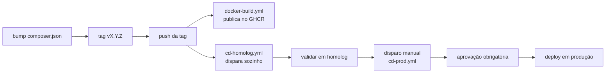

# Runbook de deploy

Fluxo de release ponta a ponta, do bump de versão até produção.



## Antes de qualquer disparo

> [!danger] Checar a validade dos tokens do GHCR
> Ambos `cd-homolog.yml` e `cd-prod.yml` puxam a imagem do GHCR com um PAT **classic**
> ([[ADR-11]]), válido por 90 dias. Um token vencido só falha no meio do deploy, depois de
> outros steps já terem mutado estado no servidor.
>
> ```bash
> gh secret list --repo xlipesousa/pmed2 | grep GHCR_TOKEN
> ```
>
> Comparar contra [[P-10]]. Se estiver a menos de 2 semanas do vencimento, rotacionar antes
> de disparar — nunca disparar e deixar falhar.

## 1. Bump de versão e tag

```bash
# editar composer.json — campo "version"
composer validate --strict   # confirma que o CI vai aceitar
git add composer.json composer.lock
git commit -m "chore: bump versão para vX.Y.Z"
git tag vX.Y.Z
git push origin main --tags
```

`composer.json.version` é a fonte da verdade — o CI valida contra semver e a UI lê dali.
Nunca deixar a tag e o `composer.json` divergirem.

## 2. Automático: build + homolog

O push da tag dispara, em paralelo:

- **`docker-build.yml`** — builda e publica `ghcr.io/xlipesousa/pmed2:vX.Y.Z`
- **`cd-homolog.yml`** — faz deploy direto em homologação

> [!warning] Os dois disparam em paralelo, sem `needs`
> O `pull` do `cd-homolog.yml` pode rodar antes da imagem existir no GHCR. Por isso há
> retry (6× 20s) no `pull` — se falhar mesmo assim, é caso de investigar o
> `docker-build.yml`, não de reação automática.

Acompanhar:

```bash
gh run list --workflow=cd-homolog.yml --limit 3
gh run watch <run-id>
```

## 3. Validar em homolog

```bash
curl -fsS http://pmed2-homologacao.4rm.eb.mil.br/health
# login real + navegação pelas telas críticas: /pacotes, /mapas, /relatorios
```

Não confiar só em `/health` — é JSON estático, passa mesmo com o banco inacessível. Ver
[[Dívida técnica]] e a tabela de armadilhas de verificação abaixo.

## 4. Disparo manual em produção

```bash
gh workflow run cd-prod.yml -f mode=deploy -f tag=vX.Y.Z
```

O environment `production` tem **required reviewer** configurado — o run pausa em
`pending_deployments` até aprovação manual pela interface do GitHub.

```bash
gh run list --workflow=cd-prod.yml --limit 3
# aprovar via UI do GitHub (Actions → run → Review deployments)
gh run watch <run-id>
```

## 5. Validar em produção

```bash
curl -fsS http://pmed2.4rm.eb.mil.br/health
docker compose -f deploy/compose.prod.yml exec -T app php artisan migrate:status | tail -5
```

Login real e navegação por `/pacotes` com dados reais — é o teste que já pegou o defeito de
[[ADR-09]] uma vez.

## Armadilhas de verificação

| Armadilha | Por quê engana | Usar no lugar |
|---|---|---|
| `/health` → 200 | Rota estática, não toca no banco | `migrate:status` dentro do container |
| `curl -I .../login` | Sem `-f`, não falha em HTTP 500 | `curl -fsS` + `grep -c csrf-token` |
| `docker login` com sucesso | Não prova que o `pull` vai funcionar | O `pull` de verdade ([[ADR-11]]) |
| Tag verde no `docker-build` | Roda em paralelo com `cd-homolog`, sem `needs` | Retry no `pull` já cobre isso |

## Não há SSH direto

Acesso aos servidores é só por **Teleport, no navegador**. Comandos server-side são
executados pelo operador humano — prefira upload de script a colar heredoc grande (trunca
em silêncio no Teleport).

Se algo der errado, ver [[Runbook de rollback]].
