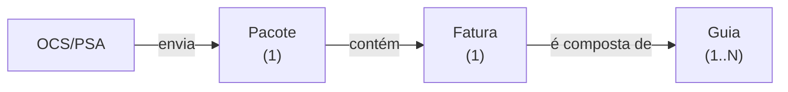

# Spec 002 — Rastreamento de guias

Pedido do cliente. **Depende da conclusão de [`001-caca-bug-protocolo`](../001-caca-bug-protocolo/spec.md)** —
ver "Ordem".

## Contexto

### A cadeia do domínio

**A guia é o documento que formaliza o atendimento médico realizado.** Seu valor soma no
valor da fatura. É a unidade atômica do negócio.

### O que a exploração encontrou

O modelo implementa os dois primeiros níveis corretamente. A fatura é 1:1 com o pacote, e por
isso está modelada como atributos dele (`numero_fatura`, `valor_fatura`) — decisão adequada,
não dívida.

**A guia não existe.** Nem tabela, nem coluna, nem model, nem tela, nem busca. A palavra não
aparece em nenhum arquivo do repositório (`grep -rni "\bguia" app/ database/ routes/
resources/` → zero ocorrências).

Ver `docs/40-decisoes/P-24.md`.

### Por que isso importa além do pedido

**O SIRE trabalha no nível da guia.** A [[especificação original]] registra que "o ciclo de
vida da guia se inicia e termina no SIRE". O PMED 2.0 acompanha a auditoria no nível do
pacote. Essa diferença de granularidade é reconciliada **manualmente pelo operador, fora do
sistema** — e é exatamente o tipo de trabalho manual que o PMED 2.0 existe para eliminar.

Implementar a guia fecha essa lacuna.

## O pedido do cliente

Passar a controlar as guias. A ideia trazida: no momento da criação do pacote, o protocolista
insere os números das guias (um botão "+ guia", por exemplo).

A necessidade declarada, e que é o critério de sucesso: **um lugar onde ele possa consultar
em que pacote/fatura está uma guia, e o inverso** — quais guias compõem uma fatura.

## Decisões

| # | Decisão | Razão | Alternativa descartada |
|---|---|---|---|
| D-1 | Modelar `guias` como tabela própria, 1:N com `pacotes` | É uma entidade de negócio real, com identidade e valor próprios. É o terceiro nível de uma cadeia que já tem dois | Campo texto com números separados por vírgula; campo JSON |
| D-2 | Relacionar a guia ao **pacote**, não a uma tabela `faturas` | A fatura é 1:1 com o pacote e está modelada como atributo dele. Criar `faturas` só para pendurar guias adicionaria um nível sem ganho | Criar a entidade `faturas` intermediária |
| D-3 | `valor` da guia é **opcional na primeira entrega** | O pedido imediato é rastreabilidade (achar a guia). O valor habilita a conciliação, que é ganho subsequente | Exigir valor desde o início e travar a entrega |
| D-4 | Não retroagir guias para pacotes existentes | Não há a informação: as guias nunca foram registradas. Inventá-las seria pior que não ter | Migração de dados a partir de alguma heurística |

## Pré-requisitos

- [ ] Rede de testes cobrindo criação e edição de pacote (F3 do plano de normalização) —
      obrigatório: esta spec toca `PacotesController::store()`, o mesmo método que carrega o
      bloqueio do bug do protocolo
- [ ] Spec 001 concluída

## Fases

### F1 — Modelo

| Passo | O quê |
|---|---|
| 1 | Migration `guias`: `id`, `pacote_id` (FK, `onDelete cascade`), `numero` (string), `valor` (decimal, nullable — D-3), `timestamps` |
| 2 | Índice único em `(pacote_id, numero)` — a mesma guia não se repete num pacote |
| 3 | Índice em `numero` — é a coluna da busca reversa ("onde está a guia X?") |
| 4 | Model `Guia`; `hasMany` em `Pacote`; `belongsTo` em `Guia` |

**Critério de aceite:** `$pacote->guias` retorna a coleção; `Guia::where('numero', X)->first()->pacote` retorna o pacote.

### F2 — Entrada na criação do pacote

| Passo | O quê |
|---|---|
| 1 | `criar.blade.php`: bloco de guias com botão "+ guia" e remoção de linha |
| 2 | `store()`: validar o array de guias (números não vazios, sem duplicata dentro do próprio pacote) e persistir **na mesma transação** do pacote |
| 3 | `editar_protocolo.blade.php`: permitir corrigir guias enquanto o pacote está em `protocolo` — mesma regra de edição já vigente |

> [!IMPORTANTE] `store()` é o método do bloqueio do bug do protocolo
> Ele já contém a verificação de duplicidade de `numero_fatura + ocs_psa_id`
> (`docs/10-dominio/Bug do protocolo.md`). **Não alterar essa verificação** ao acrescentar as
> guias, e cobrir os dois comportamentos com teste antes de mexer.

**Critério de aceite:** criar um pacote com 4 guias; as 4 persistem; recarregar a tela de
criação com erro de validação preserva as guias digitadas.

### F3 — Consulta — *o que o cliente pediu*

Duas direções, ambas necessárias:

| Direção | Onde |
|---|---|
| **Guia → pacote** ("onde está a guia X?") | Campo `numero_guia` na pesquisa avançada (`PesquisaController`); resultado leva ao pacote/fatura |
| **Pacote → guias** ("o que compõe esta fatura?") | Bloco de guias em `ver.blade.php`, junto dos dados do pacote |

**Critério de aceite:** dado um número de guia qualquer, chega-se ao pacote e à fatura em uma
busca. Abrindo o pacote, veem-se todas as suas guias.

### F4 — Conciliação *(depois, se o valor for adotado — D-3)*

Com `valor` preenchido, torna-se verificável a invariante **`valor_fatura = Σ valor_guia`**.

Vira um indicador de conferência: faturas cujo somatório das guias não bate. Isso conecta
com a invariante análoga dos mapas de pagamento
(`docs/10-dominio/Mapas de pagamento.md`), hoje também inverificável.

**Critério de aceite:** relatório lista faturas com divergência entre o valor declarado e a
soma das guias.

## Riscos

| Risco | Mitigação |
|---|---|
| Alterar `store()` quebra o bloqueio do bug do protocolo | Teste de caracterização cobrindo o bloqueio **antes** de tocar o método (pré-requisito) |
| Guias e pacote persistidos fora de transação — pacote sem guias em caso de erro | F2 passo 2: mesma transação, explicitamente |
| Escopo crescer para "fluxo próprio da guia" | Esta spec entrega **rastreabilidade**, não um segundo fluxo. Um ciclo de vida próprio para a guia é outra spec, e só se o cliente pedir depois de usar esta |
| Protocolista digitar dezenas de guias na criação | Medir na F1 quantas guias tem um pacote típico; se for alto, avaliar importação em massa antes de F2 |

## Ordem

**Depois da 001.** A spec 001 investiga e corrige a base de produção usando `store()` e a
unicidade de fatura como referência. Mexer em `store()` no meio da caça — ou migrar dados
enquanto eles ainda estão corrompidos — atrapalha as duas frentes.

## Verificação end-to-end

1. Criar pacote com N guias; as N aparecem na visualização do pacote.
2. Buscar por uma dessas guias na pesquisa avançada; chega-se ao pacote correto.
3. Tentar cadastrar a mesma guia duas vezes no mesmo pacote; é rejeitado.
4. O bloqueio de fatura duplicada (bug do protocolo) continua funcionando — teste de
   regressão explícito.
